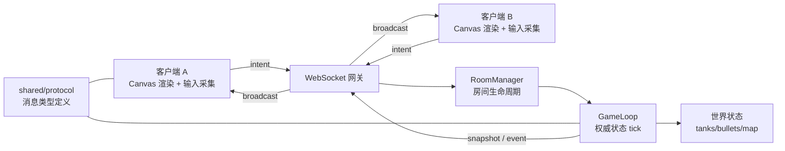

# AI 坦克竞技场 —— 在线多人坦克对战游戏 PRD

| 项 | 内容 |
|---|---|
| 文档版本 | v1.0 |
| 产品名称 | AI 坦克竞技场（AI Tank Arena） |
| 文档状态 | 待评审 |
| 团队规模 | 3～4 人 |
| 交付时长 | 约 7 小时（时间盒开发） |
| 目标平台 | 现代桌面浏览器（Chrome / Edge 最新版） |

---

## 实施基线（2026-07-29）

本文保留最初 PRD 的需求背景和范围。下列内容以当前代码为准，覆盖草案中的早期设想：

| 范畴 | 当前实现 |
|---|---|
| 联机与房间 | 四位房间号、2–4 名活跃玩家、服务端权威 30 Hz tick |
| 对局 | 初始 5 HP、砖墙 3 发可破、钢墙/边界不可破、3 分钟时限 |
| 加入中途对局 | 新连接为观战者，不参与槽位和胜负；结算中标为“观战” |
| 断线 | 浏览器 `resumeToken` 在 20 秒内自动恢复同一坦克；不做复杂断线续玩 |
| 视觉 | industrial / pixel / cartoon / neon 四套前端风格及其 Canvas 运行时素材 |
| 声音 | Web Audio 程序化反馈；命中按材质区分，按自身/距离筛选以减少混乱 |

本项目不包含账号体系、跨设备恢复、持久战绩、匹配系统或多实例房间调度。运行与当前功能说明见 [README](../README.md) 和 [运行手册](02-SETUP.md)。

---

## 1. 背景与问题定义

### 1.1 业务背景
互动游戏、在线活动、实时协作类产品普遍需要多角色协同：产品目标拆解、客户端交互、服务端状态管理、美术内容生产、工程部署与测试验证。在小型原型开发中，美术与代码常常串行推进，导致：

- 素材风格不统一
- 需求频繁变化
- 多端联调复杂度高
- 实时状态问题难以复现
- 从想法到可玩版本周期长

### 1.2 AI 引入后的新问题
AI 可辅助需求拆解、脚手架搭建、代码生成、素材创作、测试设计与故障分析，但"一次生成"不等于"工程交付"：

- 生成素材需满足尺寸、透明通道、风格约束
- 生成代码需适配现有工程并经运行验证
- 实时状态需多客户端联调
- 有效方法需沉淀为团队可再次调用的 Skill

### 1.3 本项目要回答的三个核心问题
1. 如何在 7 小时内利用 AI 完成"需求 → 素材 → 编码 → 联调 → 部署"的工程闭环？
2. 如何划分客户端表现与服务端权威状态，保证不同玩家看到一致的关键游戏结果？
3. 如何把一次性 AI 对话整理成含输入、步骤、约束、验证方法的可复用 Skill？

### 1.4 产品定位一句话
> 一个浏览器即可进入、2～4 人同房间对战、由服务端权威裁决胜负的坦克竞技 Demo，同时作为 AI-Native 研发流程的可复现样板工程。

### 1.5 非目标（Out of Scope）
- 不做复杂断线续玩（重连拿到当前快照即可）
- 不做匹配系统、账号体系、排行榜持久化
- 不做移动端适配、手柄适配
- 不做复杂玩法（技能树、道具合成、多张地图轮换等）
- 核心闭环未跑通前，不堆叠任何附加玩法

---

## 2. 目标与成功指标

### 2.1 产品目标
| 优先级 | 目标 |
|---|---|
| P0 | 两名玩家在同一房间完成一局有明确结果的对战 |
| P0 | 关键战斗状态（生命值、淘汰、胜负）双端最终一致 |
| P0 | 评审可依据 README 从干净环境启动，或访问有效预览地址 |
| P1 | 至少 2 个结构完整的可复用 Skill（≥1 个面向美术资产生产） |
| P1 | AI 参与过程可追踪、可解释 |
| P2 | 视觉资产风格统一、交互反馈清晰 |

### 2.2 成功指标（验收即指标）
- 启动成功率：干净环境按 README 执行，一次启动成功
- 一致性：正常网络下，两端显示的 HP / 淘汰 / 胜负 100% 一致
- 对局可完成率：连续 3 局均能正常判定结束
- 异常处理覆盖：≥2 类异常场景有日志与用户提示
- Skill 复用性：另一支团队可仅凭 Skill 文档复现同类产出

---

## 3. 用户与场景

### 3.1 用户角色
| 角色 | 描述 | 核心诉求 |
|---|---|---|
| 玩家 A（房主） | 首个进入者 | 快速创建房间、拿到房间号分享 |
| 玩家 B/C/D | 受邀者 | 输入房间号即刻进入同一局 |
| 评审 | 现场验收者 | 能快速启动、观察双端一致性、验证闭环 |

### 3.2 核心用户故事
- 作为玩家，我输入昵称并创建房间，得到一个可分享的房间号。
- 作为玩家，我输入相同房间号即可进入同一局，并能区分自己与他人的坦克。
- 作为玩家，我用键盘控制坦克移动与射击，能看到其他玩家的实时移动与射击。
- 作为玩家，我被子弹命中时生命值下降并有命中/爆炸反馈。
- 作为玩家，对局结束时我能看到明确的胜负结果，且与对手看到的一致。
- 作为玩家，我中途加入或刷新页面后，能看到当前对局的最新状态。
- 作为评审，我按 README 一条命令即可本地启动，一条命令即可构建/测试。

---

## 4. 功能需求

> 编号规则：F-x.y；优先级：P0 必做 / P1 应做 / P2 可做

### 4.1 F-1 房间与玩家（必做 1，P0）

| 编号 | 需求 | 验收标准 |
|---|---|---|
| F-1.1 | 创建房间 | 输入昵称点击"创建房间"，生成 4～6 位房间号并进入等待区 |
| F-1.2 | 加入房间 | 输入相同房间号可加入同一局；房间不存在时提示明确错误 |
| F-1.3 | 人数约束 | 单房间容量 2～4 人；满员时拒绝加入并提示 |
| F-1.4 | 玩家区分 | 每位玩家有唯一 ID、昵称、坦克颜色/皮肤，本人坦克有高亮标识 |
| F-1.5 | 主动离开 | 点击"离开房间"后，其坦克从所有客户端移除，玩家列表更新 |
| F-1.6 | 断线处理 | 连接断开（关页/断网）后服务端在超时窗口内移除该玩家并广播 |
| F-1.7 | 房间回收 | 房间内玩家为 0 时销毁房间，释放状态 |
| F-1.8 | 开局条件 | 人数 ≥2 且房主点击"开始对战"，或人数达 2 后倒计时自动开始（择一实现并写入 README） |

### 4.2 F-2 基础战斗（必做 2，P0）

| 编号 | 需求 | 验收标准 |
|---|---|---|
| F-2.1 | 移动 | WASD / 方向键控制上下左右移动并改变朝向 |
| F-2.2 | 射击 | 空格 / 鼠标左键发射子弹，带发射冷却（默认 300ms） |
| F-2.3 | 地图边界 | 坦克不可越界；子弹触边界消失 |
| F-2.4 | 障碍物 | 至少 1 类障碍物（如砖墙），阻挡坦克移动与子弹飞行 |
| F-2.5 | 碰撞判定 | 子弹 × 坦克、子弹 × 障碍、坦克 × 障碍、坦克 × 坦克 均有判定 |
| F-2.6 | 生命机制 | 每名玩家初始 HP=3（或 3 次复活额度），命中 -1 |
| F-2.7 | 淘汰与复活 | HP=0 判定淘汰；若采用复活模式，复活点随机且有 2s 无敌 |
| F-2.8 | 结束规则 | 满足以下任一即结束：① 仅剩 1 名存活玩家 → 该玩家胜；② 时限 3 分钟到 → 剩余 HP 高者胜，相同则平局；③ 玩家不足 2 人 → 本局中止 |
| F-2.9 | 结算界面 | 显示胜者、各玩家击杀/HP 数据，提供"再来一局"与"返回大厅" |
| F-2.10 | 自伤规则 | 子弹不伤害发射者（明确写入协议文档） |

### 4.3 F-3 状态同步（必做 3，P0）

| 编号 | 需求 | 验收标准 |
|---|---|---|
| F-3.1 | 服务端权威 | 房间、玩家、坦克位置、子弹、HP、胜负全部由服务端维护/裁决 |
| F-3.2 | 意图上行 | 客户端只发送操作意图（move / fire / stop），不直接改判定结果 |
| F-3.3 | 状态广播 | 服务端以固定频率（默认 20~30 tick/s）广播世界快照或增量 |
| F-3.4 | 事件广播 | 命中、淘汰、复活、对局结束等事件独立下发，便于表现层播特效 |
| F-3.5 | 首帧快照 | 新加入 / 刷新重进的客户端立即收到完整当前状态快照 |
| F-3.6 | 表现平滑 | 客户端对远端实体做插值/补间，避免抖动（表现层可预测，结果不可自裁） |
| F-3.7 | 冲突裁决 | 同帧多次命中，以服务端处理顺序为唯一结果，客户端以服务端为准回滚 |
| F-3.8 | 非目标 | 不要求复杂断线续玩，重进按新入局或观战处理即可 |

### 4.4 F-4 美术与反馈（必做 4，P0）

| 编号 | 需求 | 验收标准 |
|---|---|---|
| F-4.1 | 坦克资产 | 至少 1 套坦克，含 2~4 种配色区分玩家；朝向表现正确 |
| F-4.2 | 地图/障碍资产 | 地面底图 + ≥1 类障碍贴图，风格与坦克统一 |
| F-4.3 | 子弹资产 | 可辨识的子弹图形，与背景有足够对比度 |
| F-4.4 | 命中/爆炸反馈 | 命中闪白/爆炸序列帧或粒子 + 屏幕震动/音效（音效可选） |
| F-4.5 | AIGC 产出 | 所有视觉资产须由 AIGC 工具生成或迭代，保留生成记录与迭代说明 |
| F-4.6 | 资产规范 | 统一尺寸（如 64×64 / 32×32）、PNG 带透明通道、命名规范、目录集中 |
| F-4.7 | HUD | 显示自身 HP、玩家列表及 HP、剩余时间、房间号 |

### 4.5 F-5 工程运行（必做 5，P0）

| 编号 | 需求 | 验收标准 |
|---|---|---|
| F-5.1 | 平台接入 | 项目在比赛指定公司工程搭建平台完成建项 |
| F-5.2 | 构建发布 | 在规定环境完成创建、构建与发布/预览，产出可访问预览地址 |
| F-5.3 | 本地启动 | README 提供且仅提供一条明确本地启动命令（如 `pnpm dev`） |
| F-5.4 | 构建/测试命令 | README 提供一条明确构建或测试命令（如 `pnpm build` / `pnpm test`） |
| F-5.5 | 配置集中 | 地图尺寸、tick 率、HP、冷却、时限等参数集中于单一 config 文件 |
| F-5.6 | 安全 | 严禁将密钥/Token 写入仓库；使用环境变量与 `.env.example` |
| F-5.7 | 目录清晰 | client / server / shared(protocol) / assets / skills / docs 分层明确 |

### 4.6 F-6 Skill 沉淀（必做 6，P1）

| 编号 | 需求 | 验收标准 |
|---|---|---|
| F-6.1 | Skill A（必须） | 面向美术资产生产，如"坦克大战像素资产批量生成与规范化 Skill" |
| F-6.2 | Skill B（任选一） | 从 代码生成 / 多人状态同步 / 自动化测试 / 日志排障 / 工程部署 中选 1 |
| F-6.3 | 结构完整 | 每个 Skill 必含：适用场景、输入、输出、操作步骤、使用约束、验证方法、≥1 使用示例 |
| F-6.4 | 可迁移 | 步骤与约束不绑死本项目，可迁移至同类素材/工程任务 |
| F-6.5 | 反例约束 | 仅提交一段 Prompt 不视为合格 Skill |

### 4.7 F-7 鲁棒性与日志（P1）

| 编号 | 需求 | 验收标准 |
|---|---|---|
| F-7.1 | 无效输入 | 空昵称、非法房间号、超长输入均被拦截并有 UI 提示 |
| F-7.2 | 玩家断开 | 断开后其他客户端 3s 内感知，玩家列表与战场同步更新 |
| F-7.3 | 资源加载失败 | 贴图加载失败降级为几何图形绘制，并打印告警日志 |
| F-7.4 | 服务端异常 | 消息解析异常 / 未知消息类型不导致进程崩溃，记录结构化日志 |
| F-7.5 | 连接中断提示 | 客户端 WebSocket 断开时展示"连接已断开，正在重连/请刷新" |
| F-7.6 | 日志规范 | 服务端日志含 时间 / roomId / playerId / 事件类型，便于排障 |
| （要求） | 上述 F-7.1~F-7.4 中至少实现 2 类 | 现场可演示 |

### 4.8 F-8 AI 使用可追踪（P1）

| 编号 | 需求 | 验收标准 |
|---|---|---|
| F-8.1 | AI 参与记录 | `docs/AI-USAGE.md` 说明 AI 在需求分析、素材、实现、调试、验证各环节的实际参与 |
| F-8.2 | 人工判断记录 | 记录团队对 AI 产出做了哪些修改、拒绝与验证 |
| F-8.3 | Harness 说明 | 说明上下文供给、工具接入、边界约束、反馈与验证闭环 |

---

## 5. 技术方案（建议）

### 5.1 架构总览



### 5.2 技术选型建议
| 层 | 选型 | 理由 |
|---|---|---|
| 客户端 | TypeScript + Canvas 2D（可选 Vite + 轻量框架） | 上手快、渲染可控、无重依赖 |
| 通信 | WebSocket（原生 ws 或 socket.io） | 实时双向、生态成熟 |
| 服务端 | Node.js + TypeScript | 与前端共享 protocol 类型 |
| 共享层 | `shared/protocol.ts` | 消息与常量单一来源，避免双端漂移 |
| 状态存储 | 内存（单进程） | 7 小时时间盒下最简可靠 |
| 部署 | 公司指定工程搭建平台 | 题目硬性要求 |

### 5.3 消息协议（草案）

上行（Client → Server）
| type | payload | 说明 |
|---|---|---|
| `join_room` | `{ roomId?, nickname }` | 无 roomId 则创建 |
| `leave_room` | `{}` | 主动离开 |
| `start_game` | `{}` | 房主开局 |
| `input` | `{ dir: 'up'\|'down'\|'left'\|'right'\|null, seq }` | 移动意图 |
| `fire` | `{ seq }` | 射击意图 |
| `ping` | `{ t }` | 延迟探测 |

下行（Server → Client）
| type | payload | 说明 |
|---|---|---|
| `room_state` | `{ roomId, players[], phase }` | 房间与阶段变更 |
| `snapshot` | `{ tick, tanks[], bullets[], obstacles? }` | 世界快照（首帧含完整地图） |
| `event` | `{ kind: 'hit'\|'kill'\|'respawn'\|'explode', ...}` | 表现层事件 |
| `game_over` | `{ winnerId\|null, scores[] }` | 唯一权威结算 |
| `error` | `{ code, message }` | 错误提示 |

### 5.4 核心参数（集中配置）
| 参数 | 默认值 |
|---|---|
| 地图尺寸 | 960 × 640 |
| tick 频率 | 30 Hz |
| 广播频率 | 20 Hz |
| 坦克速度 | 120 px/s |
| 子弹速度 | 360 px/s |
| 射击冷却 | 300 ms |
| 初始 HP | 3 |
| 复活无敌 | 2 s |
| 对局时限 | 180 s |
| 断线判定 | 3 s 无心跳 |
| 房间容量 | 2～4 |

### 5.5 目录结构建议
```
/
├── client/          # 渲染、输入、UI、资产加载
├── server/          # 网关、RoomManager、GameLoop、裁决
├── shared/          # protocol、常量、config
├── assets/          # AIGC 产出的图像资产（规范命名）
├── skills/          # Skill A（美术）、Skill B（工程）
├── docs/            # AI-USAGE.md、协议说明、验收记录
├── .env.example
└── README.md
```

---

## 6. 分工与时间盒

### 6.1 角色分工
| 角色 | 职责 |
|---|---|
| 客户端 | 玩法与交互、渲染、输入、HUD、表现插值 |
| 服务端 | 房间、权威状态、实时通信、裁决与广播 |
| AIGC | 美术资产生产 + 资产生产 Skill |
| 工程与质量 | 平台建项与发布、测试、AI Harness、另一 Skill、演示材料 |

> 若仅 3 人，将"工程与质量"职责拆分至其他成员。分工不是边界：第 1 小时内必须共同确认 **消息协议、最小玩法、验收清单**，并尽早打通双客户端纵向闭环。

### 6.2 时间盒计划
| 时间 | 阶段 | 目标 |
|---|---|---|
| 0～0.5h | 需求拆解与平台建项 | 确认最小玩法、分工、协议、验收清单 |
| 0.5～2.5h | 最小多人闭环 | 两客户端同房间，移动与射击同步 |
| 2.5～4h | 战斗规则与素材接入 | 碰撞、HP、胜负、基础视觉反馈跑通 |
| 4～5.5h | 联调、异常与平台发布 | 修一致性问题，完成构建与发布/预览 |
| 5.5～7h | Skill、文档与演练 | 沉淀 2 个 Skill，补齐验收记录，演练展示 |

### 6.3 里程碑与 DoD
| 里程碑 | Definition of Done |
|---|---|
| M1 协议冻结 | `shared/protocol.ts` 提交，双方按此实现 |
| M2 纵向闭环 | 两个浏览器窗口能看到彼此移动 |
| M3 战斗闭环 | 命中扣血 → 淘汰 → 胜负结算双端一致 |
| M4 可访问 | 预览地址可打开并完成一局 |
| M5 资产交付 | README + 2 个 Skill + AI-USAGE + 验收记录齐备 |

---

## 7. 验收清单

### 7.1 基础门槛（全部满足才进入评分）
- [ ] 评审可依 README 启动，或访问有效预览地址
- [ ] ≥2 个独立客户端加入同一房间并完成一局
- [ ] 移动、射击、碰撞、生命值/复活、胜负闭环可现场验证
- [ ] 两个客户端最终展示一致的关键战斗结果
- [ ] 提交 ≥2 个符合格式的 Skill，其中 ≥1 个面向美术资产生产

### 7.2 评分对照（总分 100）
| 维度 | 关注点 | 分值 | 本 PRD 对应需求 |
|---|---|---|---|
| 核心玩法与完成度 | 房间、移动、射击、碰撞、HP/复活、胜负闭环 | 25 | F-1、F-2 |
| 多人状态与工程设计 | 服务端裁决清晰、多端一致、断开/加入、消息与模块设计 | 20 | F-3、5.1~5.3 |
| 公司工程平台实践 | 创建、构建、发布/预览、README 可独立复现 | 15 | F-5 |
| AI-Native 研发过程 | AI 实质参与多环节，Harness 具备上下文/工具/边界/反馈/验证 | 15 | F-8 |
| Skill 质量与可复用性 | 结构完整、可执行、可验证、可迁移 | 15 | F-6 |
| 视觉与交互体验 | 资产统一、反馈清楚、操作易理解 | 5 | F-4 |
| 测试、鲁棒性与协作 | 覆盖正常与异常、日志助排障、分工与取舍清楚 | 5 | F-7、6.1 |

### 7.3 现场演示脚本（建议）
1. 打开预览地址，玩家 A 创建房间，展示房间号。
2. 玩家 B 另开窗口输入房间号加入，展示玩家列表。
3. 开局，双端同时展示移动与射击同步。
4. A 命中 B，双端同时展示 HP 变化与命中特效。
5. 打完 B 全部 HP，双端同时展示相同胜负结果。
6. 演示异常：关闭 B 窗口，A 端 3s 内看到玩家移除与提示。
7. 展示服务端日志中的 roomId/playerId/事件链路。
8. 展示 2 个 Skill 文档与一次实际调用记录。

---

## 8. 风险与应对
| 风险 | 影响 | 应对 |
|---|---|---|
| 协议后期变更导致双端返工 | 高 | 第 1 小时冻结协议，改动走同步评审 |
| 客户端自行判定造成不一致 | 高 | 严格"意图上行、结果下行"，客户端不写判定逻辑 |
| AIGC 资产风格/尺寸不统一 | 中 | 资产 Skill 内置尺寸、透明通道、色板约束与校验步骤 |
| 平台发布流程卡点 | 中 | 0～0.5h 先完成建项与一次空壳发布，跑通链路 |
| 特效与玩法抢占时间 | 中 | 闭环未通前特效降级为纯色矩形占位 |
| 单进程内存状态丢失 | 低 | 明确非目标，不做持久化 |

---

## 9. 交付物清单
1. 可运行源码仓库（client / server / shared / assets / skills / docs）
2. 有效预览地址或可复现启动方式
3. `README.md`：一条本地启动命令 + 一条构建/测试命令 + 操作说明 + 参数说明
4. `shared/protocol.ts` 及协议文档
5. AIGC 视觉资产（坦克、地图/障碍、子弹、命中/爆炸）及生成迭代说明
6. `skills/` 下 ≥2 个结构完整 Skill（≥1 个美术资产生产）
7. `docs/AI-USAGE.md`：AI 参与与人工判断记录、Harness 说明
8. 验收记录（对照 7.1 / 7.2 的自查结果与截图/录屏）
9. 演示材料与分工、关键取舍说明

---

## 10. 附：Skill 模板（两个 Skill 必须遵循）

```markdown
# Skill 名称

## 1. 适用场景
何时用、不适用于什么场景。

## 2. 输入
必填/选填输入项、格式与示例值。

## 3. 输出
产出物形态、目录、命名规范、质量标准。

## 4. 操作步骤
1) …  2) …  3) …（可被他人照做执行）

## 5. 使用约束
尺寸/透明通道/色板/命名/性能/安全等硬约束与禁止项。

## 6. 验证方法
如何判定产出合格：检查清单、脚本、对比基线。

## 7. 使用示例
一次真实调用：输入 → 中间过程 → 最终产出 → 验证结论。
```

> 提醒：完成一个稳定、可解释的双人闭环，优先于实现很多不稳定功能。美术资产数量、代码行数、AI 对话次数、Prompt 长度均不单独计分。
