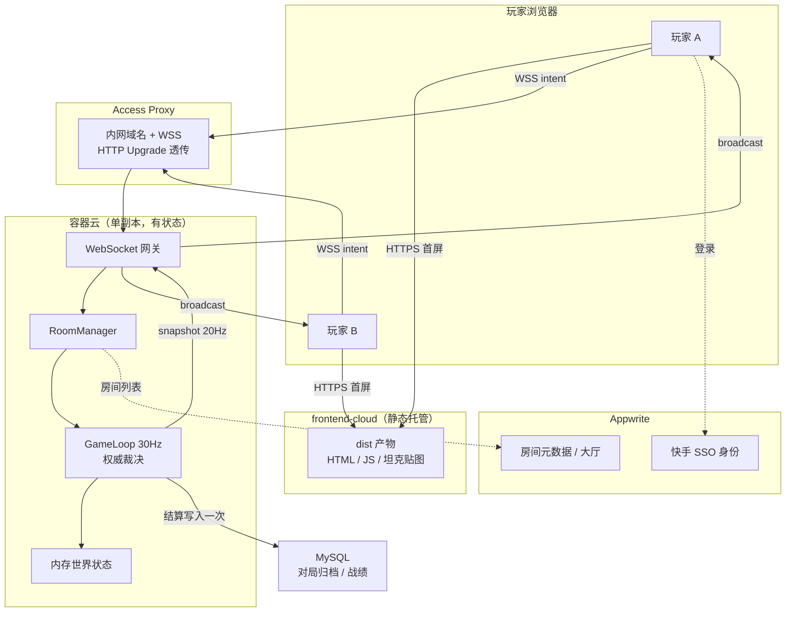

# PRD 附录 A：内部基建承载方案（部署与数据链路）

> 配套主文档：`PRD-AI坦克竞技场.md` 第 5 章技术方案
> 状态：待现场核验（标注 ⚠️ 的项必须在 0～0.5h 时间盒内实测确认）

---

## 0. 一条不能绕过的硬约束（先读这段）

**`frontend-cloud` 是纯静态站托管平台**，只做 ZIP 打包上传 + CDN 分发，**不能运行常驻进程，因此无法承载 WebSocket 服务端**。

而本项目的必做 3「服务端权威状态同步」要求一个**有状态、常驻、30Hz tick 的进程**。

由此得出的架构结论：

```
静态前端  →  frontend-cloud（满足"公司工程平台实践"15 分）
权威服务端 →  容器云（唯一能跑常驻有状态进程的地方）
对外暴露  →  Access Proxy（提供内网域名 + HTTPS/WSS + SSO 鉴权）
持久化    →  MySQL（仅存对局归档，不参与实时链路）
```

⚠️ **最容易翻车的一个点**：静态站是 `https://` 域名，浏览器会**阻止**页面向 `ws://` 发起连接（Mixed Content）。必须确保 Access Proxy 提供 `wss://` 且支持 **HTTP Upgrade 透传**。这一条必须在第一个小时用一个 echo server 实测，否则 4～5.5h 联调阶段会直接卡死。

---

## 1. 能力 → 基建 映射总表

| # | 能力需求 | 承载基建 | 用法 | 可替代方案 | 风险 |
|---|---|---|---|---|---|
| 1 | 静态前端托管（HTML/JS/贴图） | **frontend-cloud** | `frontend-cloud-cli deploy --dir dist` | 容器云内 Nginx 静态目录 | 低 |
| 2 | WebSocket 权威服务端（常驻+有状态） | **容器云** | Node 容器，单副本，暴露 8080 | 无（静态站/云函数均不可） | 中 ⚠️ |
| 3 | 对外访问 + HTTPS/WSS + 内网鉴权 | **Access Proxy** | 绑内网域名 → 反代容器 Service | 容器云自带 Ingress | 中 ⚠️ |
| 4 | 用户身份（昵称/头像免手填） | **快手 SSO** | `OAuthProvider.Kuaishou` + `handleOAuth2Token` | 前端手填昵称 | 低 |
| 5 | 房间元数据 / 大厅列表 | **Appwrite（frontend-cloud）** | legacy Databases + Collection | 服务端内存 Map | 低 |
| 6 | 对局归档、战绩、排行榜 | **MySQL** | 结算时一次性写入 | Appwrite Collection | 低 |
| 7 | 贴图 / 音效 CDN | **frontend-cloud** 静态资源 或 Appwrite Storage | 随 dist 一起发布 | — | 低 |
| 8 | 低频后台任务（清理僵尸房、日报） | **Appwrite Functions** | `schedule: "*/5 * * * *"` CRON | 服务端 setInterval | 低 |
| 9 | 前端工程构建流水线 | **KFX** ⚠️ | 见 §6 | 本地 build + CLI 部署 | 中 ⚠️ |
| 10 | 服务端日志与排障 | 容器云日志面板 | 结构化 JSON 日志 | — | 低 |

---

## 2. 推荐架构（方案 A：静态前端 + 容器云权威服务端）



### 为什么实时链路不走 Appwrite / 云函数

| 尝试 | 为何不可行 |
|---|---|
| 云函数跑 GameLoop | 函数是**无状态短时**模型，默认 timeout 15s，无法维持 30Hz 常驻 tick |
| 数据库轮询同步状态 | 30Hz 写库 = 每秒数十次写放大，延迟与成本都不可接受 |
| 云函数做碰撞裁决 | 每次调用冷启动 + 单次执行，无法保证同帧顺序一致性 |

> 云函数**唯一合适的位置**：低频、无状态、可容忍秒级延迟的旁路任务（清理僵尸房间、写战绩、生成日报）。

---

## 3. 容器云部署要点

### 3.1 必须单副本（或房间亲和路由）

世界状态在**进程内存**里。如果扩到多副本且负载均衡随机打散，玩家 A 和玩家 B 会连到**两个不同进程**，各自维护一份世界状态 —— 直接违反"双端结果一致"的核心验收项。

7 小时时间盒下的正确做法：

```yaml
replicas: 1          # ← 硬性要求，不要为了"高可用"改成 2
strategy: Recreate   # 不要 RollingUpdate，避免新旧副本同时在线
```

若确实需要多副本，必须做 **roomId 一致性哈希路由**（网关按 roomId 决定转发到哪个 Pod）。这属于超纲项，**闭环未通前不要做**。

### 3.2 Dockerfile 骨架

```dockerfile
FROM node:20-alpine
WORKDIR /app
COPY package*.json ./
RUN npm ci --registry https://npm.corp.kuaishou.com/ --omit=dev
COPY dist-server ./dist-server
COPY shared ./shared
ENV PORT=8080
EXPOSE 8080
CMD ["node", "dist-server/index.js"]
```

### 3.3 健康检查（容器云必配）

```javascript
// 容器云存活/就绪探针依赖此接口，缺失会导致 Pod 反复重启
app.get('/healthz', (req, res) => res.json({
  ok: true,
  rooms: roomManager.size,
  players: roomManager.playerCount,
  uptime: process.uptime(),
}));
```

| 探针 | 路径 | 说明 |
|---|---|---|
| liveness | `/healthz` | 失败则重启容器 |
| readiness | `/healthz` | 失败则从 Service 摘流 |

⚠️ **注意**：WebSocket 是长连接，容器重启会踢掉所有在场玩家。探针的 `initialDelaySeconds` 和 `failureThreshold` 要放宽，避免 GC 抖动引发误杀。

### 3.4 环境变量（严禁写入仓库）

| 变量 | 用途 | 来源 |
|---|---|---|
| `PORT` | 监听端口 | 容器云注入 |
| `MYSQL_HOST` / `MYSQL_USER` / `MYSQL_PASSWORD` / `MYSQL_DATABASE` | 归档库 | 容器云 Secret / 配置中心 |
| `APPWRITE_ENDPOINT` / `APPWRITE_PROJECT_ID` | 房间元数据 | 非敏感，可入 `.env.example` |
| `ALLOWED_ORIGINS` | WS 来源白名单 | 配置项 |

仓库只提交 `.env.example`，真实值全部走容器云 Secret 挂载。对应主文档 **F-5.6**。

---

## 4. Access Proxy 要点

### 4.1 必须确认的三件事 ⚠️

| 项 | 为什么关键 | 验证方式 |
|---|---|---|
| 支持 **HTTP Upgrade** 透传 | 不支持则 WebSocket 握手直接 400/502 | 部署一个 echo WS，用 `wscat` 连通 |
| 提供 **wss://** | 静态站是 https，ws:// 会被浏览器拦截 | 浏览器 Console 看是否报 Mixed Content |
| **空闲超时** 配置 | 默认 60s 超时会周期性踢掉长连接 | 挂 5 分钟不操作，看是否断开 |

### 4.2 心跳保活

即使代理超时放宽，也应主动保活。这同时复用为断线检测（对应主文档 F-1.6）：

```javascript
// 服务端：25s 一次 ping，双重作用 = 保活 + 断线检测
const HEARTBEAT_MS = 25_000;
setInterval(() => {
  wss.clients.forEach(ws => {
    if (ws.isAlive === false) return ws.terminate();  // 判定断线
    ws.isAlive = false;
    ws.ping();
  });
}, HEARTBEAT_MS);

ws.on('pong', () => { ws.isAlive = true; });
```

### 4.3 域名与前端配置

```typescript
// shared/config.ts —— 单一来源，对应主文档 F-5.5
export const WS_URL = import.meta.env.PROD
  ? 'wss://tank-arena-ws.<access-proxy-域名>/ws'   // ← 生产：Access Proxy
  : 'ws://localhost:8080/ws';                       // ← 本地
```

---

## 5. MySQL 数据链路

### 5.1 定位：只做归档，不进实时链路

```
实时状态（30Hz）  → 内存，不落库
对局结算（1 次/局）→ MySQL 写入
战绩查询（低频）   → MySQL 读取
```

**绝对不要**把坦克坐标、子弹位置写进 MySQL。7 小时时间盒下，MySQL 是"加分项"而非"必需项" —— 如果实时闭环还没跑通，**跳过 MySQL**，主文档已明确"内存状态、不做持久化"为非目标。

### 5.2 表设计（最小可用）

```sql
-- 对局记录
CREATE TABLE `match_record` (
  `id`          BIGINT UNSIGNED NOT NULL AUTO_INCREMENT,
  `room_id`     VARCHAR(16)  NOT NULL COMMENT '房间号',
  `winner_id`   VARCHAR(64)  NULL     COMMENT '胜者 playerId，NULL 表示平局',
  `player_cnt`  TINYINT      NOT NULL COMMENT '参战人数',
  `duration_ms` INT UNSIGNED NOT NULL COMMENT '对局时长',
  `end_reason`  VARCHAR(32)  NOT NULL COMMENT 'last_survivor / timeout / aborted',
  `created_at`  DATETIME     NOT NULL DEFAULT CURRENT_TIMESTAMP,
  PRIMARY KEY (`id`),
  KEY `idx_room_created` (`room_id`, `created_at`)
) ENGINE=InnoDB DEFAULT CHARSET=utf8mb4 COMMENT='对局归档';

-- 玩家单局数据
CREATE TABLE `match_player` (
  `id`         BIGINT UNSIGNED NOT NULL AUTO_INCREMENT,
  `match_id`   BIGINT UNSIGNED NOT NULL,
  `player_id`  VARCHAR(64)  NOT NULL COMMENT 'SSO 用户标识',
  `nickname`   VARCHAR(64)  NOT NULL,
  `kills`      TINYINT UNSIGNED NOT NULL DEFAULT 0,
  `deaths`     TINYINT UNSIGNED NOT NULL DEFAULT 0,
  `hp_left`    TINYINT      NOT NULL DEFAULT 0,
  `is_winner`  TINYINT(1)   NOT NULL DEFAULT 0,
  PRIMARY KEY (`id`),
  KEY `idx_match` (`match_id`),
  KEY `idx_player` (`player_id`)
) ENGINE=InnoDB DEFAULT CHARSET=utf8mb4 COMMENT='玩家单局数据';
```

### 5.3 写入时机与失败降级

```javascript
// 只在 game_over 广播之后写库，且必须失败不影响玩法
async function onGameOver(room, result) {
  broadcast(room, { type: 'game_over', ...result });   // ← 先保证玩家体验

  try {
    await archiveMatch(room, result);
  } catch (err) {
    // 归档失败绝不能影响对局闭环，仅告警
    logger.warn({ evt: 'archive_failed', roomId: room.id, err: err.message });
  }
}
```

⚠️ 这个 `try/catch` 是**有意为之**：MySQL 抖动不应该导致玩家看不到胜负结果。它同时构成主文档 **F-7.4「服务端异常不导致崩溃」** 的一个可演示用例。

### 5.4 连接池

```javascript
const pool = mysql.createPool({
  host: process.env.MYSQL_HOST,
  user: process.env.MYSQL_USER,
  password: process.env.MYSQL_PASSWORD,
  database: process.env.MYSQL_DATABASE,
  connectionLimit: 5,        // Demo 场景够用，避免占满内网库连接配额
  connectTimeout: 3000,      // 快速失败，不阻塞 GameLoop
  timezone: '+08:00',
});
```

---

## 6. KFX 定位说明 ⚠️

KFX 在本方案中的确切定位**需要现场向平台同学确认**。根据它可能的两种形态，分别对应不同用法：

| 若 KFX 是… | 在本项目中的用法 | 是否必需 |
|---|---|---|
| **前端工程/构建流水线平台** | 托管 `client/` 构建：Git push → 自动 `npm run build` → 产出 dist → 发布到 frontend-cloud | 可选，能替代手工 `deploy` |
| **Serverless / FaaS 平台** | 同 Appwrite Functions 的定位：低频旁路任务，**不承载实时 GameLoop** | 可选 |

**决策建议**：本题「公司工程平台实践」15 分的判定标准是"正确完成项目创建、构建、发布或预览"。用 `frontend-cloud-cli` 已可完整满足。**KFX 属于加分项，不要在核心闭环跑通前投入时间接入**。

---

## 7. 时间盒对齐：基建接入顺序

必须遵守"**先打通链路，再填业务**"。以下顺序把所有 ⚠️ 高风险项压在第一个小时。

| 时间 | 基建动作 | 产出物（可验证） |
|---|---|---|
| 0～0.5h | ① `appwrite-cf login-ks`<br>② frontend-cloud 建项 + 发布空壳 index.html<br>③ 容器云建 echo WS 服务<br>④ Access Proxy 绑域名 | **静态页能通过 wss:// 收到 echo 回包** ← 这是本阶段唯一目标 |
| 0.5～2.5h | 服务端换成真 RoomManager + GameLoop | 两窗口同房间看到彼此移动 |
| 2.5～4h | 贴图随 dist 发布；HUD 接入 | 战斗闭环 + 视觉反馈 |
| 4～5.5h | 容器云重新发版；健康检查、日志、异常演练 | 线上地址可完整打一局 |
| 5.5～7h | （可选）MySQL 归档；补 README / Skill | 归档表有数据；文档齐备 |

> 第一个 0.5h 的验收物**不是**代码，而是那条 `wss://` echo 通路。任何一个环节（容器云网络策略 / Proxy Upgrade / 证书）出问题，都必须在这里暴露，而不是留到 4h 后联调。

---

## 8. 降级预案

按"保住基础验收门槛"的优先级排序 —— 门槛项一票否决，宁可砍掉所有加分项。

| 卡点 | 降级动作 | 影响 |
|---|---|---|
| Access Proxy 不支持 WSS/Upgrade | 前端也部署到容器云同域（Nginx 静态 + WS 同源），绕过跨域与混合内容 | 损失部分"平台实践"分，保住核心 20 分 |
| 容器云申请流程慢 | 现场同一局域网内起本地 server，评审连内网 IP | 损失"发布/预览"分，保住可玩性 25 分 |
| MySQL 权限没批下来 | 直接砍掉归档，或降级写 Appwrite Collection | 无影响（本就是非目标） |
| SSO 集成受阻 | 退回前端手填昵称 + 服务端生成 playerId | 无影响（题目未要求登录） |
| KFX 接入不顺 | 直接放弃，用 `frontend-cloud-cli` 手工部署 | 无影响 |

---

## 9. 对主文档的增补需求

以下需求编号补充进 `PRD-AI坦克竞技场.md` 第 4 章：

| 编号 | 需求 | 验收标准 | 优先级 |
|---|---|---|---|
| F-5.8 | 服务端部署于容器云，**单副本**运行 | 容器云控制台可见 Pod Running，replicas=1 | P0 |
| F-5.9 | 提供 `/healthz` 健康检查接口 | 返回 200 且含 rooms/players/uptime | P0 |
| F-5.10 | 生产环境经 Access Proxy 以 **wss://** 访问 | 浏览器无 Mixed Content 报错，握手 101 | P0 |
| F-5.11 | 前端静态产物部署至 frontend-cloud | 固定地址可访问且资源无 404 | P0 |
| F-5.12 | 全部密钥经容器云 Secret 注入，仓库仅留 `.env.example` | 仓库全文检索无明文凭证 | P0 |
| F-3.9 | WS 心跳保活 25s，超时判定断线 | 挂机 5 分钟不断连；关窗后 3s 内其他端感知 | P0 |
| F-7.7 | MySQL 归档失败不影响对局闭环 | 断开库连接后仍能正常打完一局，日志有 warn | P1 |
| F-9.1 | 对局结束后写入 MySQL 归档 | `match_record` / `match_player` 有对应记录 | P2 |
| F-9.2 | 大厅房间列表（Appwrite 或内存） | 可见当前活跃房间与人数 | P2 |
