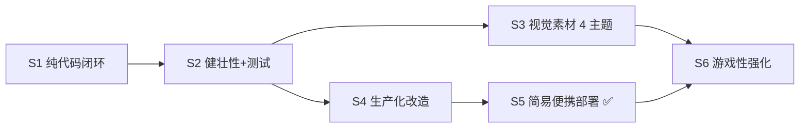

# 实施路线图

> **总原则**：玩法闭环优先，部署降级为简易便携包，视觉与游戏性按优先级迭代交付。
> 每个 Stage 结束都必须留下**可运行、可验证、可回滚**的产物。

> 📝 **实际开发过程与关键决策的理由见 [`../06-PROGRESS.md`](../06-PROGRESS.md)**。
> 本文件是计划，`PROGRESS.md` 是已发生的事实。

---

## 当前进展（截至 `3bd961c`）

| Stage | 状态 | 说明 |
|---|---|---|
| **S1** | ✅ **已完成（超额）** | 四个子阶段全部验收；额外完成随机地图、倒计时、可破坏砖墙、相撞伤害 |
| **S2** | ✅ **已完成** | 异常处理、结构化日志、视觉反馈、单测全部就位 |
| **S3** | 🔸 **进行中（25%）** | industrial 主题已接入；pixel / cartoon / neon 三套素材待生产 |
| **S4** | ✅ **已完成** | 配置外置、健康检查、心跳保活、优雅退出、离线便携包 |
| **S5** | ✅ **简易部署完成** | 离线便携包 `dist/tank-arena-0.1.0-linux-x64.tar.gz`，解压即启动 |
| **S6** | ⬜ 未开始 | 游戏性强化与加分项，按优先级迭代 |

**当前测试水位**：单测 34/34、冒烟 156/156。

---

## 阶段总览

| Stage | 主题 | 产出 | 状态 |
|---|---|---|---|
| **S1** | 纯代码本地闭环 | 双窗口打完一局 | ✅ |
| **S2** | 健壮性与可测试性 | 异常处理 + 单测 + 日志 | ✅ |
| **S3** | 视觉素材（4 主题） | AIGC 贴图全部接入 | 🔸 25% |
| **S4** | 生产化改造 | 配置外置、健康检查、便携包 | ✅ |
| **S5** | 部署 | 简易便携包 `./start.sh` | ✅ |
| **S6** | 游戏性 & 体验打磨 | 见下方迭代列表 | ⬜ |



---

## S1 & S2 — 已完成（存档）

见 `PROGRESS.md`，不再重复。核心成果：

- 服务端权威、30Hz tick、双端结果一致
- 随机地图（BFS 连通性校验）+ 随机出生点
- 砖墙 3 发可破 + 相撞伤害 + 开局倒计时
- 单测 34/34、冒烟 156/156
- 全局 Toast、断线遮罩、resumeToken 重连

---

## S3 — 视觉素材（4 主题）

**目标**：industrial 已完成，补全另外三套主题的 AIGC 贴图。

### 当前状态

| 主题 | 素材 | 渲染器接入 | 状态 |
|---|---|---|---|
| `industrial`（军械终端） | ✅ 全部 PNG 已生产 | ✅ drawImage 已接入 | ✅ |
| `pixel`（像素街机） | ⬜ | ⬜ | ⬜ |
| `cartoon`（手绘战术） | ⬜ | ⬜ | ⬜ |
| `neon`（霓虹赛博） | ⬜ | ⬜ | ⬜ |

### 每套主题需要的素材清单

| 资产 | 规格 | 备注 |
|---|---|---|
| `tank-red/blue/green/yellow.png` | 64×64 透明 PNG | 俯视角，4 色变体 |
| `tile-ground.png` | 32×32 | 地面底色，无缝平铺 |
| `tile-brick-1/2/3.png` | 32×32 | 砖墙三级耐久 |
| `tile-steel.png` | 32×32 | 不可破钢块 |
| `tile-border-steel.png` | 32×32 | 边界墙 |
| `bullet.png` | 16×16 透明 PNG | |
| `fx-explosion.png` | 256×64（4 帧横排） | 爆炸特效 |
| `fx-hit.png` | 64×16（4 帧） | 命中闪光 |
| `fx-brick-debris.png` | 128×32（4 帧） | 砖墙碎块 |
| `fx-countdown-pulse.png` | 64×16（4 帧） | 倒计时脉冲 |
| `fx-start-burst.png` | 128×32（4 帧） | 开始爆发 |
| `fx-wall-spark.png` | 64×16（4 帧） | 子弹撞墙火花 |
| `fx-ram.png` | 128×32（4 帧） | 相撞冲击 |
| `ui-hp-pip-full/empty.png` | 12×12 | 血量方块 |
| `ui-countdown-frame.png` | 64×64 | 倒计时框 |
| `ui-go-frame.png` | 128×48 | "GO!"框 |
| `ui-panel-corner.png` | 16×16 | 面板装饰角 |
| `ui-self-ring.png` | 72×72 透明 PNG | 自机高亮环 |

### S3 验收

- [ ] 四套主题各自在 `assets/<theme>/` 目录下有完整素材
- [ ] 切换主题后画面风格即变，无加载失败回退
- [ ] 加载失败时自动降级几何绘制，游戏仍可玩
- [ ] `server/` 与 `shared/` 无任何改动

---

## S4 — 生产化改造（已完成）

| 项 | 状态 | 说明 |
|---|---|---|
| 配置外置（PORT/HOST/LOG_LEVEL） | ✅ | `server/config.js` |
| WS 地址自适应（ws/wss 自动推导） | ✅ | `client/net.js` |
| `/healthz` 健康检查 | ✅ | 含 rooms/players/uptime |
| 心跳保活（25s ping/pong） | ✅ | 穿透代理空闲超时 |
| 优雅退出（SIGTERM 广播维护提示） | ✅ | |
| 离线便携包脚本 | ✅ | `scripts/build-portable.sh` |

---

## S5 — 部署（简易便携包）

**策略**：不使用容器云/内网基建，使用离线便携包直接在评审机运行。

### 当前状态

```
dist/tank-arena-0.1.0-linux-x64.tar.gz  (42 MB)
运行时：内置 Node v22.20.0，GLIBC_2.28+
```

### 目标机部署

```bash
tar -xzf tank-arena-0.1.0-linux-x64.tar.gz
cd tank-arena-0.1.0-linux-x64
./start.sh            # 启动
./health.sh           # 验证
./stop.sh             # 停止
```

### CentOS 7（glibc 2.17）版本

```bash
npm run build:portable:centos7
# 产出 dist/tank-arena-0.1.0-linux-x64-glibc-217.tar.gz
```

### S5 验收

- [x] `./start.sh` 无报错，输出包含 `运行时 OK`
- [x] `curl http://localhost:3000/healthz` 返回 `{"ok":true,...}`
- [x] 两个浏览器窗口可进同一房间完成一局
- [x] `assets/` 美术素材随包传递

---

## S6 — 游戏性强化与体验打磨

**按优先级排序，可独立迭代，每项均可单独验收。**

### P1：视觉完整性（紧接 S3 进行）

| # | 内容 | 备注 |
|---|---|---|
| 6.1 | 补全 pixel / cartoon / neon 三套美术素材 | 用 `game-asset-forge` Skill 生产 |
| 6.2 | 每套主题接入渲染器 | 仿 industrial 已有实现 |

### P2：游戏性丰富

| # | 内容 | 说明 |
|---|---|---|
| 6.3 | **道具系统**：地图随机生成护盾/加速/双倍伤害道具 | 定时刷新，拾取即生效 |
| 6.4 | **多地图预设**：除随机地图外提供 3 张固化地图（十字中央、环形跑道、角落堡垒） | 开局时房主可选 |
| 6.5 | **坦克升级**：击杀累计 2 次后炮管增粗、子弹变大 | 纯视觉 + 伤害提升 |
| 6.6 | **子弹弹射**：击中钢块后反弹，最多弹 2 次 | 增加战术深度 |
| 6.7 | **观战模式**：已淘汰玩家可选择跟随视角观战 | 服务端已有 spectator 标记 |

### P3：体验打磨

| # | 内容 | 说明 |
|---|---|---|
| 6.8 | **音效**：射击、命中、爆炸、倒计时各一个音效 | Web Audio API，可静音 |
| 6.9 | **战绩统计**：本 session 内的多局 KDA 累计显示 | 纯前端，不需要数据库 |
| 6.10 | **断线续玩体验优化**：重连后直接回到对局，而非大厅 | resumeToken 已有基础 |
| 6.11 | **移动端适配**：触摸方向盘 + 射击按钮 | Canvas 叠加 touch UI |

### P4：可选加分项（依赖外部资源）

| # | 内容 | 依赖 |
|---|---|---|
| 6.12 | 容器云部署 + Access Proxy（获取内网域名） | 容器云权限 |
| 6.13 | 快手 SSO 登录（免手填昵称） | SSO 权限 |
| 6.14 | MySQL 对局归档 | 数据库权限 |

---

## 明确不做

| 项 | 原因 |
|---|---|
| 客户端预测 / 插值 | 30Hz 已足够流畅，预测引入一致性风险 |
| 多副本水平扩展 | 与内存态世界状态冲突，超纲 |
| Vite / React / TS | 零构建更快更稳 |

---

## 全局验收清单

**核心（S1+S2，已全绿）**

- [x] 干净环境 `npm install && npm run dev` 一次成功
- [x] 两窗口同房间完成一局，双端 HP 与胜负结果一致
- [x] 撞墙/越界/不自伤/无敌期规则正确
- [x] 关窗后另一端 3s 内感知
- [x] 无效输入有提示；服务端异常不崩进程
- [x] `npm test` 全绿（34/34）+ `npm run smoke:all`（156/156）

**部署（S4+S5，已完成）**

- [x] `PORT=9000 npm start` 能在 9000 端口启动
- [x] `/healthz` 返回房间数与在线人数
- [x] 挂机 5 分钟连接不断
- [x] 便携包 `./start.sh` 一键启动

**进行中 / 待完成**

- [x] industrial 主题美术素材接入，加载失败降级几何绘制
- [ ] pixel / cartoon / neon 三套主题素材接入
- [ ] 道具系统（P2 优先）
- [ ] 多地图预设
- [ ] （可选）容器云 + SSO + MySQL
