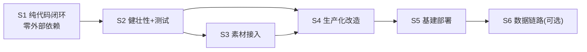

# 实施路线图：从纯代码 MVP 到公司基建交付

> **总原则**：先把玩法闭环在本地跑通并锁死，再逐层往外接。
> 每个 Stage 结束都必须留下**可运行、可验证、可回滚**的产物；上一 Stage 未验收不进入下一 Stage。

> 📝 **实际开发过程与关键决策的理由见 [`../PROGRESS.md`](../PROGRESS.md)**。
> 本文件是计划，`PROGRESS.md` 是已发生的事实。

---

## 当前进展

最后更新：`9372734`（随机出生点、开局倒计时、可破坏砰墙、相撞伤害）

| Stage | 状态 | 说明 |
|---|---|---|
| **S1** | ✅ **已完成（超额）** | 四个子阶段全部验收；额外完成随机地图、倒计时、可破坏砰墙、相撞伤害 |
| **S2** | ⚠️ **部分完成（~70%）** | 异常处理、结构化日志、视觉反馈已完；**`physics.js` 单测已补齐** |
| **S3** | ⬜ 未开始 | 现为几何占位，规范已固化 |
| **S4** | 🔸 部分具备（~20%） | 结构化日志与 `/healthz` 已提前完成 |
| **S5** | ⬜ 未开始 | 需先做 S5.1 WSS 通路验证 |
| **S6** | ⬜ 未开始 | 加分项 |

**当前测试水位**：单测 18/18、冒烟 155/155。

下一步建议：补齐 `physics.js` 单测将 S2 收尾 → 直接进 S4（S5 前置）。
S3 与 S4 无强依赖，可并行。

---

## 阶段总览

| Stage | 主题 | 产出 | 依赖外部资源 | 预估 | 状态 |
|---|---|---|---|---|---|
| **S1** | 纯代码本地闭环 | `npm run dev` 双窗口打完一局 | ❌ 无 | 3.5h | ✅ |
| **S2** | 健壮性与可测试性 | 异常处理 + 单测 + 结构化日志 | ❌ 无 | 1h | ⚠️ |
| **S3** | 视觉素材接入 | 几何占位 → AIGC 贴图 | ⚠️ AIGC 工具 | 1h | ⬜ |
| **S4** | 生产化改造 | 配置外置、构建产物、健康检查 | ❌ 无 | 0.75h | 🔸 |
| **S5** | 公司基建部署 | 线上可访问地址 | ⚠️ 容器云/Proxy | 1.5h | ⬜ |
| **S6** | 可选数据链路 | SSO 身份 + MySQL 归档 | ⚠️ 权限审批 | 1h | ⬜ |

**S1+S2 是不可协商的核心**（约 4.5h）。S3～S6 均可独立降级，任一受阻不影响已交付成果。



> S3 与 S4 无强依赖，可并行。S4 是 S5 的**前置**：不先把配置外置，部署必然返工。

---

## 前置设计决策（贯穿全程，先定避免返工）

### 决策 1：S1 阶段零构建工具链

| 方案 | 取舍 |
|---|---|
| ❌ Vite + React + TS | 需配 build、dev proxy、双进程，MVP 阶段纯负担 |
| ✅ 原生 ESM + Canvas，Node 直接托管静态文件 | 单进程、单命令、零构建、**同源无 CORS** |

**同源是关键收益**：Node 同时托管页面和 WebSocket，前端连 `ws://localhost:8080/ws` 与页面同源，
彻底绕开跨域、混合内容、代理配置三类问题。这些问题留到 S5 一次性面对。

### 决策 2：`shared/` 被浏览器和 Node import **同一个物理文件**

```
server/ --import--> shared/constants.js <--import-- client/
                    shared/protocol.js
```

全项目 `type: module`，浏览器通过 `/shared/*.js` 静态路由拿到与 Node 相同的文件。
协议常量天然只有一份，不存在双端漂移 —— 满足主 PRD **F-5.5**。

### 决策 3：地图用网格 tilemap，不用任意矩形

障碍是 `30×20` 的 `0/1` 二维数组，每格 32px。碰撞退化成"算出实体覆盖哪几格，查数组"，
O(4) 而非 O(n)，代码量减半，且避开浮点缝隙穿墙的经典 bug。

### 决策 4：tick 与广播同频 30Hz

主 PRD 写 tick 30 / 广播 20，**MVP 统一 30Hz**：4 人 × 30Hz × ~300B ≈ 36KB/s，本地无压力。
少一套节流逻辑 = 少一处 bug。33ms 一帧本身够流畅，故 **S1 不实现插值**。

### 决策 5：客户端永久零判定

客户端只做：**采集按键 → 发意图**、**收快照 → 画图**。
不预测、不本地扣血、不本地判胜负。这是"双端一致"门槛项唯一稳妥路径。

> ⚠️ 此约束在 S3～S6 全程有效。接素材、上基建都不得为了"看起来流畅"而在客户端加判定。

---

## S1 — 纯代码本地闭环（零外部依赖）

**目标**：`npm install && npm run dev`，两个浏览器窗口进同一房间打完一局，双端结果一致。
**范围**：不接素材、不接基建、不接数据库。视觉全用 Canvas 几何图形。

### 关键参数（`shared/constants.js`）

```javascript
export const TILE = 32;
export const COLS = 30, ROWS = 20;          // 960 × 640
export const TICK_HZ = 30;
export const TANK_SIZE = 24;
export const TANK_SPEED = 120;              // px/s
export const BULLET_SIZE = 6;
export const BULLET_SPEED = 360;            // px/s
export const FIRE_COOLDOWN_MS = 300;
export const MAX_HP = 3;
export const RESPAWN_INVULN_MS = 2000;
export const MATCH_DURATION_MS = 180_000;
export const ROOM_MIN = 2, ROOM_MAX = 4;
export const HEARTBEAT_MS = 25_000;
export const DISCONNECT_TIMEOUT_MS = 3_000;
export const COLORS = ['#e94f37', '#3f88c5', '#44bba4', '#f6ae2d'];
```

> ⚠️ **部分参数已随迭代变化**，以 `shared/constants.js` 为准。主要变动：
>
> | 参数 | 计划值 | 当前值 | 原因 |
> |---|---|---|---|
> | `TANK_SIZE` | 24 | **26** | 让「车体 + 炮筒」的视觉完全装进碰撞盒 |
> | — | — | `TANK_BODY = 18` | 车体绘制尺寸（纯视觉，不参与碰撞）|
> | — | — | `BARREL_LEN = 4` | 18 + 4×2 = 26 = 碰撞盒 |
> | — | — | `COUNTDOWN_MS = 3000` | 开局准备期 |
> | — | — | `MAP_FILL_RATIO = 0.08` | 内部障碍占比 |
> | — | — | `MAP_STEEL_RATIO = 0.45` | 钢块占障碍的比例 |
> | — | — | `BRICK_HP = 3` | 砖墙耐久 |
> | — | — | `RAM_DAMAGE / RAM_COOLDOWN_MS` | 相撞伤害与冷却 |
> | — | — | `MIN_SPAWN_DISTANCE = 240` | 出生点最小间距 |

### 消息协议（`shared/protocol.js`）

**上行 C→S**

| type | payload | 备注 |
|---|---|---|
| `join` | `{ roomId?, nickname }` | 无 roomId 则创建 |
| `leave` | `{}` | |
| `start` | `{}` | 仅房主有效 |
| `input` | `{ dir }` | `'up'\|'down'\|'left'\|'right'\|null`；**仅状态变化时发** |
| `fire` | `{}` | 服务端按冷却裁决 |

**下行 S→C**

| type | payload | 备注 |
|---|---|---|
| `joined` | `{ selfId, roomId, isHost }` | 身份确认 |
| `room` | `{ roomId, phase, players[], hostId }` | 房间变更时发 |
| `snapshot` | `{ t, m, tanks[], bullets[], timeLeft, cd?, mp? }` | 30Hz；**首帧附带 `map`** |
| `event` | `{ kind, ... }` | `hit\|kill\|respawn`，纯表现用 |
| `over` | `{ winnerId, reason, scores[] }` | 唯一权威结算 |
| `error` | `{ code, message }` | |

> `map` 只在玩家第一帧下发（约 600B），后续快照不重复带 —— 唯一刻意做的优化，
> 因为每帧带 map 会让流量翻 10 倍。

**快照字段的后续补充**（均为实现中新增）：

| 字段 | 含义 | 为何必需 |
|---|---|---|
| `m` | matchId，局次标识 | `t` 单调递增已足够，但换局时客户端需知道「基准变了」。**缺少此字段曾导致严重缺陷**，见 `PROGRESS.md` §3.1 |
| `cd` | 倒计时剩余 ms | 客户端据此绘制 3-2-1；为 0 时表示已开打 |
| `mp` | 地图增量 `[{c,r,v}]` | 砖墙被击破时只下发变更格。全量重发会让流量翻十倍 |

### 服务端权威循环

```
每 33ms（Room.tick，用真实 dt 积分）:
  1. 按 player.moveDir 尝试移动
       → 地图边界 → tilemap 障碍 → 与其他坦克 AABB
       → 任一失败则不移动（不做滑动修正）
  2. 推进子弹
       → 出界/撞墙 → 销毁
       → 命中非发射者且非无敌 → HP-1，销毁子弹，推 hit 事件
  3. HP 归零 → 推 kill 事件，标记 dead
  4. 检查结束：存活≤1 → last_survivor；时间到 → timeout（比 HP，同则平局）；人数<2 → aborted
  5. 广播 snapshot（+ 累积 event）
```

**结束判定只在服务端发生一次**，`over` 是所有客户端胜负显示的唯一来源。

### S1 子步骤

| # | 内容 | 验证方式 | 状态 |
|---|---|---|---|
| **S1.1** | 脚手架：`server/index.js` 托管 `client/`+`shared/`、`/healthz`、WS echo | 浏览器 Console 看到 echo 回包 | ✅ `c9b520f` |
| **S1.2** | 房间与玩家：`RoomManager`/`Room`、join/leave/断线/满员拒绝、大厅 UI | 两窗口互见玩家列表；关窗 3s 内更新 | ✅ `95b8d29` |
| **S1.3** ★ | 移动同步：`map.js`+`physics.js`+30Hz 广播+`render.js` | A 移动 B 立刻看到；撞墙停住；不越界 | ✅ `5b68613` |
| **S1.4** | 战斗闭环：射击冷却、命中扣血、淘汰结算、胜负判定、HUD、结算面板 | 双端 HP 与胜负结果完全一致 | ✅ `db108a8` |

> **S1.3 完成即技术风险归零**，之后全是填充式开发。

### S1 验收

- [x] 干净目录 `npm install && npm run dev` 一次成功
- [x] 两窗口进同一房间号，双端看到彼此移动、射击
- [x] 命中扣血，双端 HP 数值一致
- [x] 一方淘汰，双端显示**相同**胜负结果
- [x] 撞墙、越界被正确阻止
- [x] 关闭一个窗口，另一端 3s 内感知

### S1 阶段额外完成项

以下不在原计划内，根据实际试玩反馈补充（详见 `PROGRESS.md` §4）：

| 项 | 提交 | 要点 |
|---|---|---|
| 地图每局随机生成 | `66e4290` | 比例固定 + 出生安全区 + BFS 连通性校验 |
| 图块区分边界/内部障碍 | `66e4290` | 为 S3 替换素材预留语义 |
| 出生点每局随机 | `9372734` | 拒绝采样，间距 ≥240px |
| 开局 3-2-1 倒计时 | `9372734` | 新增 `PHASE.COUNTDOWN` |
| 砖墙 3 发可破 | `9372734` | 耐久编码进图块值，变更走增量下发 |
| 相撞造成伤害 | `9372734` | 双向扣血 + 强制冷却 |
| 炮筒不再穿墙 | `9372734` | 缩小视觉而非扩大碰撞 |
| 全局 Toast | `9372734` | 消除「错误写进隐藏元素」这一类缺陷 |
| 血量可见性强化 | `9372734` | 坦克头顶血条 + HUD 分段方块 |

---

## S2 — 健壮性与可测试性（零外部依赖）

**目标**：把 S1 的"能跑通"变成"跑得住、查得清、测得到"。

### 视觉反馈补全（仍用几何图形）

| 效果 | 实现 | 状态 |
|---|---|---|
| 命中 | 受击坦克闪白 3 帧 | ✅ |
| 爆炸 | 淘汰点扩散圆环 + 透明度衰减（纯 Canvas，零素材） | ✅ |
| 无敌 | 坦克半透明闪烁 | ✅ |
| 砖墙受损/击破 | 裂纹叠加；击破用碎块四散、仅扣耐久用小尘土 | ✅ 额外 |
| 相撞 | 交叉冲击线 | ✅ 额外 |
| 开局倒计时 | 3-2-1 放大淡出 + 「开始！」 | ✅ 额外 |

### 异常处理（对应主 PRD F-7，至少 2 类）

| 场景 | 处理 | 状态 |
|---|---|---|
| 空昵称 / 非法房间号 / 房间满员 | 服务端回 `error`，前端 Toast 提示 | ✅ |
| WS 断开 | 全屏遮罩"连接已断开，请刷新" | ✅ |
| 未知消息类型 / JSON 解析失败 | 服务端 try-catch + 告警日志，**不崩进程** | ✅ |
| 单房间 tick 异常 | 捕获后销毁该房间，不影响其他房间 | ✅ |

> Toast 已改为**全局固定定位**而非按视图挑选错误元素。
> 后者曾导致错误被写进隐藏元素、表现为「点击毫无反应」，见 `PROGRESS.md` §3.2。

### 结构化日志（`server/logger.js`）

```javascript
// 统一格式，便于 S5 上容器云后直接被日志平台采集
log({ evt: 'player_join', roomId, playerId, nickname });
// → {"ts":"2026-07-28T09:00:00.000Z","level":"info","evt":"player_join",...}
```

⚠️ 日志格式在 S2 就定成 JSON 单行，是为了 S5 上容器云时**零改动**被日志平台解析。

### 单元测试（`node:test` 内置，零额外依赖）

| 用例 | 断言 | 状态 |
|---|---|---|
| 撞墙不位移 | 坦克坐标不变 | 🔶 冒烟已覆盖，单测缺 |
| 越界被拦 | 坐标限制在地图内 | 🔶 同上 |
| 子弹不伤发射者 | 发射者 HP 不变 | 🔶 同上 |
| 无敌期不扣血 | HP 不变 | 🔶 同上 |
| 存活 1 人 → 结束 | `reason === 'last_survivor'` | 🔶 同上 |
| 时间到 → 比 HP | 高 HP 者为 winner；相同则 `winnerId === null` | 🔶 同上 |

> 之所以把 `physics.js` 写成**纯函数**，就是为了这一步能零 mock 直接测。

**当前测试实况**（详见 `PROGRESS.md` §5）：

| 层 | 文件 | 数量 | 状态 |
|---|---|---|---|
| 单元 | `test/map.test.js` | 18 | ✅ 注入种子 PRNG，完全可复现 |
| 单元 | `test/physics.test.js` | — | ❌ **仍缺失，S2 收尾的唯一阻塞项** |
| 冒烟 | `scripts/smoke-room.js` | 39 | ✅ |
| 冒烟 | `scripts/smoke-move.js` | 48 | ✅ |
| 冒烟 | `scripts/smoke-brick.js` | 14 | ✅ 需随机地图 |
| 冒烟 | `scripts/smoke-combat.js` | 54 | ✅ 需空旷地图（`TANK_EMPTY_MAP=1`）|

上表六条断言目前**由冒烟测试从端到端层面覆盖**，因此规则正确性有保障；
但缺少纯函数层的快速单测，定位问题时仍需启服务。

`npm run smoke:all` 一条命令跑全部 155 项，自动管理服务端生命周期并按组切换地图模式。

### S2 验收

- [x] `npm test` 全绿（18/18）
- [x] 空昵称被拦并有提示
- [x] `kill` server 进程后客户端出现断开遮罩
- [x] 服务端日志为单行 JSON，含 `roomId`/`playerId`
- [x] 连续打 3 局均正常判定结束
- [ ] **`physics.js` 纯函数单测**（已完成）

---

## S3 — 视觉素材接入（可降级）

**目标**：把几何占位替换为 AIGC 素材，**不触碰任何逻辑代码**。

### 前置约束

素材规范已固化在 `assets/README.md`：PNG 带透明通道、坦克 64×64、墙体必须等于 `TILE`(32)、
命名 `kebab-case`、色板与 `COLORS` 一致、单文件 <50KB。

### 实施

| # | 内容 |
|---|---|
| S3.1 | 用 AIGC 工具产出 4 色坦克、砖墙、子弹、爆炸序列帧 |
| S3.2 | `client/assets.js`：统一预加载 + Promise.all 等待 |
| S3.3 | `render.js` 把 `fillRect` 换成 `drawImage` |
| S3.4 | **加载失败降级**：任一贴图加载失败则回落到几何绘制 + 告警日志 |

⚠️ **S3.4 不是可选项**。它既是主 PRD F-7.3「资源加载失败」的实现，
也保证 S3 永不成为阻塞项 —— 素材没做好，游戏照样能跑。

### S3 验收

- [ ] 四类资产（坦克/地图/子弹/命中爆炸）均可辨识且风格统一
- [ ] 断网或删图后自动回落几何绘制，游戏仍可玩
- [ ] `server/` 与 `shared/` 无任何改动（`git diff` 证明）

---

## S4 — 生产化改造（零外部依赖，S5 前置）

**目标**：让代码具备"能被部署"的形态。**这一步不碰任何平台，纯本地改造。**

> 🔸 **已提前具备**：结构化 JSON 日志（`server/logger.js`）与 `/healthz` 在 S1/S2 阶段已完成。
> 剩余待做：配置外置、WS 地址自适应、心跳保活、优雅退出、产物整理。

### 4.1 配置外置

```javascript
// server/config.js —— 环境变量优先，带默认值
export const PORT = Number(process.env.PORT) || 8080;
export const HOST = process.env.HOST || '0.0.0.0';
export const LOG_LEVEL = process.env.LOG_LEVEL || 'info';
export const ALLOWED_ORIGINS = (process.env.ALLOWED_ORIGINS || '*').split(',');
```

### 4.2 WS 地址自适应（S5 成败关键）

```javascript
// client/net.js —— 不硬编码，从当前页面推导
const proto = location.protocol === 'https:' ? 'wss:' : 'ws:';
const WS_URL = `${proto}//${location.host}/ws`;
```

⚠️ 这段代码让**本地 `ws://` 与线上 `wss://` 零配置切换**。
如果 S1 里硬编码了 `ws://localhost:8080`，S5 上线必然白屏（Mixed Content 拦截）。
这是整条路线里最容易被忽略、代价最高的一个点，所以提前到 S4 处理。

### 4.3 健康检查强化

```javascript
// 容器云存活/就绪探针依赖此接口，缺失会导致 Pod 反复重启
GET /healthz → { ok, rooms, players, uptime }
```

### 4.4 心跳保活

```javascript
// 25s 一次 ping，双重作用：穿透代理空闲超时 + 断线检测
const HEARTBEAT_MS = 25_000;
setInterval(() => {
  wss.clients.forEach(ws => {
    if (ws.isAlive === false) return ws.terminate();
    ws.isAlive = false;
    ws.ping();
  });
}, HEARTBEAT_MS);
ws.on('pong', () => { ws.isAlive = true; });
```

### 4.5 优雅退出

```javascript
// 收到 SIGTERM 时先广播"服务维护中"再退出，避免玩家一脸茫然
process.on('SIGTERM', () => { broadcastShutdown(); server.close(() => process.exit(0)); });
```

### 4.6 前端产物整理

MVP 无构建步骤，`npm run build` 定义为**校验 + 拷贝**到 `dist/`（若 S5 需要分离静态托管）。
保持 `dist/` 在 `.gitignore` 中。

### S4 验收

- [ ] `PORT=9000 npm start` 能在 9000 端口启动
- [ ] `curl localhost:8080/healthz` 返回房间数与在线人数
- [ ] 挂机 5 分钟连接不断
- [ ] `kill -TERM` 时客户端收到维护提示而非静默断开
- [ ] 全局搜索无硬编码 `localhost` / `ws://`

---

## S5 — 公司基建部署（依赖外部资源）

**目标**：产出评审可直接访问的线上地址。

### 5.1 架构约束（必须先理解）

`frontend-cloud` 是**纯静态托管**，不能跑常驻进程，**无法承载 WebSocket**。
而本项目需要一个有状态、常驻、30Hz tick 的进程。因此：

```
静态前端   → frontend-cloud（满足"公司工程平台实践" 15 分）
权威服务端 → 容器云（唯一能跑常驻有状态进程的地方）
对外暴露   → Access Proxy（内网域名 + HTTPS/WSS + SSO）
```

> 完整论证见 `02-PRD-附录A-内部基建部署方案.md`。

### 5.2 部署形态二选一

| 形态 | 说明 | 推荐度 |
|---|---|---|
| **A 同源单体** | 前后端都跑在容器云，Node 同时托管静态与 WS | ⭐ 推荐：同源，无跨域/混合内容风险 |
| **B 前后分离** | 前端 → frontend-cloud，WS → 容器云 + Proxy | 更贴合"平台实践"评分，但需处理跨域 |

**建议先做 A 保证可用，再叠加 B 拿平台分**（B 失败可随时回退 A）。

### 5.3 子步骤

| # | 内容 | 关键点 |
|---|---|---|
| **S5.1** ⚠️ | **WSS 通路验证**：容器云起 echo 服务 + Proxy 绑域名 | 见下方说明，**必须最先做** |
| S5.2 | Dockerfile + 容器云建项 | `replicas: 1`、`strategy: Recreate` |
| S5.3 | 配置健康探针 | `initialDelaySeconds` 放宽，避免 GC 抖动误杀 |
| S5.4 | 环境变量走 Secret 挂载 | 仓库仅留 `.env.example` |
| S5.5 | （形态 B）前端发布 frontend-cloud | `frontend-cloud-cli deploy --dir dist` |
| S5.6 | 线上双端联调 | 两台设备/两个网络实测一局 |

### ⚠️ S5.1 必须最先做的理由

有三个**只在线上暴露**的风险，任一未通则整个 S5 卡死：

| 风险 | 后果 |
|---|---|
| Proxy 不支持 HTTP Upgrade 透传 | WS 握手直接 400/502 |
| 未提供 `wss://` | 静态站是 https，浏览器拦截 ws://（Mixed Content） |
| Proxy 空闲超时过短（如 60s） | 长连接被周期性踢掉 |

**S5.1 的交付物不是代码，而是"一条能通的 wss:// echo 回包"**。
必须在写任何部署配置之前用 `wscat` 或浏览器实测通过。

### 5.4 单副本硬约束

世界状态在**进程内存**。多副本 + 随机负载均衡会让玩家 A 和 B 连到**两个不同进程**，
各自维护一份世界状态 —— 直接违反"双端结果一致"门槛项。

```yaml
replicas: 1          # ← 硬性要求，不要为"高可用"改成 2
strategy: Recreate   # 避免新旧副本同时在线
```

多副本需 roomId 一致性哈希路由，**属超纲项，不做**。

### S5 验收

- [ ] 线上地址浏览器可直接打开，无 Console error
- [ ] 浏览器无 Mixed Content 报错，WS 握手返回 101
- [ ] 两台不同设备可进同一房间完成一局
- [ ] 挂机 5 分钟连接不断
- [ ] 容器云日志面板可查到结构化日志
- [ ] 仓库全文检索无明文凭证

---

## S6 — 可选数据链路（依赖权限审批）

**目标**：加分项。**任一环节受阻立即跳过，不影响 S1～S5 成果。**

| # | 内容 | 承载 | 降级方案 |
|---|---|---|---|
| S6.1 | 快手 SSO 身份（免手填昵称头像） | `OAuthProvider.Kuaishou` | 退回前端手填昵称 |
| S6.2 | 对局归档、战绩 | MySQL | 跳过（PRD 已列为非目标） |
| S6.3 | 大厅房间列表 | Appwrite Collection / 内存 | 用服务端内存 Map |
| S6.4 | 清理僵尸房间 | Appwrite Functions CRON | 服务端 `setInterval` |

### 归档失败必须降级

```javascript
async function onGameOver(room, result) {
  broadcast(room, { type: 'over', ...result });   // ← 先保证玩家体验
  try {
    await archiveMatch(room, result);
  } catch (err) {
    logger.warn({ evt: 'archive_failed', roomId: room.id, err: err.message });
  }
}
```

⚠️ 这个 `try/catch` 是**有意为之**：MySQL 抖动不应导致玩家看不到胜负结果。
它同时构成主 PRD **F-7.4** 的一个可演示用例。

### 实时链路禁止事项

| 禁止 | 原因 |
|---|---|
| 云函数跑 GameLoop | 无状态短时模型，默认 timeout 15s，撑不住 30Hz 常驻 tick |
| 数据库轮询做状态同步 | 30Hz 写库 = 数十倍写放大，延迟与成本不可接受 |
| 云函数做碰撞裁决 | 冷启动 + 单次执行，无法保证同帧顺序一致 |

云函数**唯一合适的位置**：低频、无状态、可容忍秒级延迟的旁路任务。

---

## 明确不做（全阶段）

| 项 | 原因 |
|---|---|
| 客户端预测 / 插值 | 30Hz 已足够流畅，且预测会引入"客户端自行判定"的一致性风险 |
| 断线续玩 | 题目明确非目标 |
| 多副本水平扩展 | 与内存态世界状态冲突，需一致性哈希，超纲 |
| Vite / React / TS | 零构建更快更稳 |
| 音效、多地图、道具 | 闭环优先 |

---

## 风险与对策

| 风险 | 阶段 | 对策 | 实际 |
|---|---|---|---|
| 坦克 24px 卡在 32px 网格通道 | S1 | 地图通道 ≥2 格宽；碰撞失败直接停，不做滑动修正 | ✅ 未发生（现 26px < 32px 仍有余量）|
| 高频 `input` 刷爆上行 | S1 | 仅在按键状态**变化**时发送，非每帧发 | ✅ 未发生 |
| `setInterval` 漂移累积 | S1 | tick 内用真实 `dt` 积分，不假设固定 33ms | ✅ 未发生 |
| 两窗口共享 localStorage 串号 | S1 | 身份完全由服务端分配 `selfId`，客户端不持久化 | ✅ 未发生 |

**计划外实际发生的问题**（全部已修复并加回归测试，详见 `PROGRESS.md` §3）：

| 问题 | 根因 | 严重度 |
|---|---|---|
| 「再来一局」需等待很久 | `startGame()` 重置 `tick`，客户端乱序保护把新局帧全丢弃 | 🔴 高 |
| 错误提示被写进隐藏元素 | 按视图挑选错误元素，未覆盖「结算面板在 game 视图」 | 🟠 中 |
| 相撞判定漏检 | 容差 `+2` 时 `dx=28` 恰好判不中 | 🟠 中 |
| 钢砖比例剧烈波动 | 图块类型按**块**决定，2×2 占 4 格致方差极大 | 🟡 低 |
| 测试隐含时序假设 | 参数变化后固定等待时长不再够用 | 🟡 低 |
| 端口占用静默连错实例 | 未检测端口占用，连到地图模式相反的残留服务 | 🟡 低 |
| 素材尺寸/风格不统一 | S3 | 规范前置在 `assets/README.md`；加载失败自动降级 |
| 线上 WSS 不通 | S5 | S5.1 提前实测；失败则回退同源单体形态 A |
| 容器云审批慢 | S5 | 现场局域网起本地 server，评审连内网 IP |
| MySQL/SSO 权限未批 | S6 | 直接跳过，本就是加分项 |

---

## 全局验收清单

**S1～S2（核心，必须全绿）**
- [x] 干净环境 `npm install && npm run dev` 一次成功
- [x] 两窗口同房间完成一局，双端 HP 与胜负结果一致
- [x] 撞墙/越界/不自伤/无敌期规则正确
- [x] 关窗后另一端 3s 内感知
- [x] 无效输入有提示；服务端异常不崩进程
- [x] `npm test` 全绿（18/18）+ `npm run smoke:all`（155/155）
- [x] README 可让他人从零复现
- [ ] `physics.js` 纯函数单测（S2 收尾）

**S3～S6（增强，可选择性达成）**
- [ ] 四类视觉资产统一，加载失败可降级
- [ ] `PORT` 等配置可由环境变量覆盖
- [ ] 线上地址可访问并完成一局，WS 握手 101
- [ ] 容器云单副本 + 健康探针正常
- [ ] 仓库无明文密钥
- [ ] （可选）SSO 登录 / MySQL 归档可用
